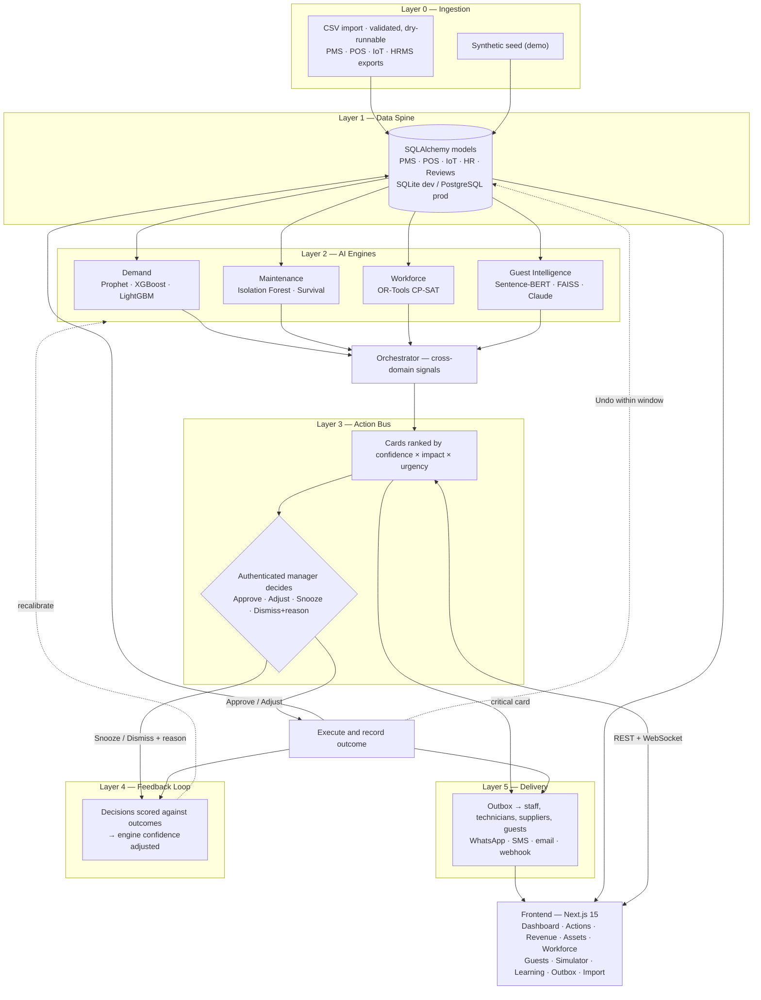

# Smart Resort 360

An AI-powered resort operations platform that unifies demand forecasting, predictive maintenance, workforce optimization, and guest intelligence into a single decision layer. Every insight surfaces as an approvable action card: the AI recommends, a named manager decides, the system executes, **the people affected are told**, and the outcome feeds back to calibrate future confidence.

Built for HackCelestial 3.0 — Problem Statement 4 by Team VOID.

**Stack:** Next.js 15 · React 19 · FastAPI · SQLAlchemy 2 · Python 3.11

---

## System Flow



---

## Features

| Module | Description |
|---|---|
| Live Dashboard | Real-time occupancy, revenue, sentiment, equipment health, and staffing gaps from a single data spine |
| Action Bus | AI-generated action cards ranked by impact. Approve, **adjust and approve**, snooze, or dismiss with a reason |
| Demand & Revenue | Prophet + XGBoost forecasting with rate recommendations inside floor/ceiling guardrails |
| Predictive Maintenance | Isolation Forest anomaly detection and survival analysis over IoT telemetry |
| Workforce Optimizer | OR-Tools CP-SAT solver assigning staff to shifts under labour and demand constraints |
| Guest Intelligence | Sentence-BERT embeddings and FAISS similarity search for guest profiling, plus an AI concierge |
| Revenue Simulator | What-if modelling of price, staffing, and promotion levers before committing |
| Feedback Loop | Acceptance, dismissal *reasons*, edit rate and reversals adjust future engine confidence |
| Delivery | Approved actions reach the people who must act — staff, technicians, suppliers, guests — over WhatsApp, SMS, email or webhook, with a persisted outbox |
| Data Import | Validated, dry-runnable CSV ingestion for ten datasets, so a real property can load its own history |
| Roles & Audit | Token-based identity with per-engine approval rights; every decision is signed by a verified principal |
| Undo & Shadow Mode | Executed actions are reversible inside a window, and shadow mode previews everything without writing |
| Cold Start | Per-engine data-maturity assessment, so a new property is told what the models do *not* yet know |
| 3D Resort Model | Three.js scene where lit windows map to rooms sold and markers to asset risk |
| Live Updates | New action cards pushed to the dashboard over WebSocket |

---

## Repository Layout

```
HackCelestial/
├── frontend/                 Next.js 15 app (App Router, Tailwind, Three.js, Recharts)
│   ├── app/                  One route per module — dashboard, actions, revenue,
│   │                         assets, workforce, guests, simulator, learning
│   ├── components/           Shared UI, charts, 3D scene, action card view
│   └── lib/                  API client, formatters, live-data hook
├── backend/                  FastAPI service
│   ├── app/
│   │   ├── main.py           App entrypoint and WebSocket hub
│   │   ├── models.py         SQLAlchemy models (data spine)
│   │   ├── api/routes.py     REST endpoints
│   │   ├── core/             Settings, session factory, clock, auth,
│   │   │                     notification transport, live-update signal
│   │   ├── engines/          demand · maintenance · workforce · guest
│   │   │                     orchestrator · action bus · messaging
│   │   ├── ingest/           CSV importers + cold-start readiness
│   │   └── seed/             Two-year synthetic data generator
│   ├── scripts/smoke.py      End-to-end smoke test
│   ├── tests/                54 regression tests, run by CI
│   ├── requirements.txt      Light runtime set
│   └── requirements-ml.txt   Full ML stack
├── .github/workflows/        CI (tests + build) and the keep-alive cron
├── netlify.toml              Frontend deployment config
└── render.yaml               Backend blueprint
```

---

## Local Development

**Prerequisites:** Node.js 18+, Python 3.11+

### Backend

```bash
cd backend
python -m venv venv
source venv/bin/activate            # Windows: .\venv\Scripts\activate

pip install -r requirements-ml.txt  # or requirements.txt for the light set
python -m app.seed.generate         # seeds two years of resort data
uvicorn app.main:app --reload --port 8000
```

API at `http://localhost:8000`, health check at `/health`.

### Frontend

```bash
cd frontend
npm install
npm run dev
```

App at `http://localhost:3000`.

### Verify

1. Open the dashboard and confirm live data loads.
2. Run all engines to generate action cards.
3. Approve one, adjust-and-approve another, dismiss a third with a reason.
4. Undo the approved one and watch the retraction appear in **Outbox**.
5. Open the Feedback Loop page and score outcomes.

The full suite runs from `backend/`:

```bash
python -m unittest discover -s tests -v   # 54 regression tests
```

CI (`.github/workflows/ci.yml`) runs those, seeds a throwaway database, runs the
smoke test, and typechecks and builds the frontend on every push and PR.

The same path can be exercised headlessly — data spine → engines → action bus → approve → execute → outcome scoring:

```bash
cd backend
python -m scripts.smoke
```

---

## Loading Real Data

The engines are only as good as Layer 1, and the seed generator is a demo, not a
product. `/import` takes a validated CSV per dataset — `room_categories`,
`guests`, `bookings`, `occupancy`, `staff`, `assets`, `sensor_readings`,
`reviews`, `inventory`, `events`.

CSV rather than a PMS connector is deliberate: Opera, Cloudbeds and Micros each
need their own auth, pagination and field mapping, and a half-finished connector
is worse than an export every property already knows how to produce.

- **Dry-run first.** Validation reports every bad row with its line number and
  the offending value, writes nothing, and tells you what *would* land.
- **Row-level errors.** One malformed row in nine thousand is reported, not
  fatal.
- **Idempotent where a natural key exists.** Re-importing an overlapping export
  updates the night rather than double-counting it.
- Blank templates are downloadable per dataset from the same page.

**Cold start.** A new property has no history, and the engines will still emit
confident-looking cards. `/api/readiness` reports per-engine data maturity
(`cold` / `learning` / `trusted`) and the dashboard carries a banner saying so
until each engine has a full seasonal cycle. Nothing is blocked — a new property
still wants its recommendations; it just needs to know what they are worth.

---

## Closing the Loop: Notifications

Approving a card used to end at a database write. The three housekeepers who had
just been rostered, the technician who had to service the chiller, and the
supplier receiving the purchase order all learned nothing.

Execution now queues messages to the people who have to act:

| Card | Who is told |
|---|---|
| Roster change | Each named staff member; unfilled slots go to the duty manager |
| Work order | Maintenance technicians, plus the duty manager |
| Purchase order | The duty manager **and** the supplier who must fulfil it |
| Escalation | The duty manager |
| Guest offer | The guest, on a channel they will actually check |
| Rate change | The duty manager, quoting the rate that was *actually applied* |
| Any **critical** card | Pushed the moment it is raised, not when someone opens a browser |

Messages are queued inside the decision transaction and delivered by a
background drainer, so an SMTP timeout can never roll back a roster change that
already happened, and a message survives a restart between decision and send.
Every attempt is persisted and visible at `/notifications` — "nobody told me" is
a real operational dispute, and the outbox is the answer to it. Failed messages
can be re-queued from the same page.

Channels degrade rather than fail: with no Twilio or SMTP credentials configured
everything logs to the console, which is the correct default for local work.

---

## Roles and Accountability

The product's claim is that a *named* manager decides. That only holds if the
name is verified, so `decided_by` now comes from the authenticated principal
rather than the request body.

Set `AUTH_USERS` as comma-separated `token:Display Name:role` triples:

```
AUTH_USERS=s3cret-gm:Ravi Menon:gm,s3cret-rev:Priya Nair:revenue_manager
```

| Role | May approve | Also |
|---|---|---|
| `gm` | Everything | Import data, undo, run engines |
| `revenue_manager` | Pricing | Undo, run engines |
| `ops_manager` | Maintenance, workforce | Undo, run engines |
| `duty_manager` | Guest, workforce | Run engines |
| `analyst` | — | Run engines |
| `viewer` | — | Read only |

There is no user table: a resort's real identity provider is its HRMS or an SSO
tenant, and inventing a half-finished one here would be worse than deferring to
a token list ops can rotate with one environment variable.

**With `AUTH_USERS` unset the API stays open** so local demos need no sign-in —
but it logs an error at boot on a public deployment, `/health` reports
`"auth": "DISABLED"`, and decisions are recorded as
`Demo Manager (unauthenticated)` so an audit row can never be mistaken for a
real approval.

---

## Trust Controls

A manager who cannot reverse a mistake will not approve the first
recommendation, let alone the hundredth.

- **Adjust and approve.** Managers negotiate with recommendations rather than
  accepting them whole. A rate rise approved at half the suggested number
  executes the manager's figure and records the delta — previously the only way
  to express "right direction, wrong magnitude" was Dismiss, which taught the
  demand engine it had simply been wrong.
- **Dismissal reasons.** `already_handled`, `stale_data`, `local_knowledge`,
  `too_risky`, `not_worth_it`, `wrong_timing`. Only the reasons that mean the
  *model* misfired count against its confidence; a card dismissed because the
  front desk had already dealt with it is a timing problem, not a calibration
  one, and is excluded from the denominator.
- **Undo.** Every card kind has a reverser. Inside `UNDO_WINDOW_MINUTES` an
  executed action can be rolled back — the rate restored, the work order
  cancelled, the shifts withdrawn, the PO voided — and everyone notified earlier
  is told it no longer applies. A work order somebody has already started is
  refused rather than silently erased.
- **Shadow mode.** `SHADOW_MODE=true` runs the real executor and rolls it back,
  so a property can watch for a month before letting the system touch the roster
  or the rate card. The preview comes from the same code path that would have
  done the work, so it cannot drift.

---

## Deployment

### Backend — Render

The repo ships `render.yaml`, so a Blueprint deploy needs no manual configuration: connect the repo on Render, set `ANTHROPIC_API_KEY` if the LLM concierge is wanted, and deploy.

To configure by hand, create a Python web service with root directory `backend`, build command `pip install -r requirements.txt && python -m app.seed.generate`, start command `uvicorn app.main:app --host 0.0.0.0 --port $PORT --workers 1`, and health check path `/health`.

**Light vs. full dependency set.** `requirements.txt` contains only what the API needs to boot (FastAPI, SQLAlchemy, pandas, numpy, scikit-learn) and installs from wheels in about two minutes. The heavy stack lives in `requirements-ml.txt`; `sentence-transformers` alone pulls PyTorch (~2.5 GB), which will not fit the free tier's 512 MB. Every heavy import is lazy and guarded, so the API stays fully functional without them — the affected engines log a warning and degrade:

| Missing package | Engine | Fallback |
|---|---|---|
| `prophet` | Demand | Seasonal-naive baseline |
| `xgboost` | Demand | Prophet/naive leg only |
| `lightgbm` | Maintenance | Trend and anomaly rules |
| `ortools` | Workforce | Greedy scheduler |
| `faiss-cpu` | Guest | NumPy cosine search |
| `sentence-transformers` | Guest | Hashed bag-of-words |

Render's free tier uses ephemeral disk: the build seeds SQLite into the instance image, so demo data is present on boot and resets on each deploy. For persistent data, attach managed PostgreSQL and set `DATABASE_URL`.

#### Keeping the instance awake

A free Render instance sleeps after roughly 15 minutes without an inbound request and takes about 50 seconds to wake, so the first visitor after a quiet spell watches a cold boot instead of the dashboard. Two independent pingers cover that, because each fails in a way the other survives:

1. **In-process self-ping** — `backend/app/core/keepalive.py` requests `/health` every 10 minutes. A request the instance sends to its own public URL comes back through Render's router, which the idle timer counts as traffic. The target is `KEEPALIVE_URL`, or `RENDER_EXTERNAL_URL` if that is unset, which Render injects into every service — so a Blueprint deploy needs no configuration. Neither is set locally, so the loop stays dormant in development, and `/health` reports `"keepalive": "on"` wherever it is running. It cannot help once the instance is *already* asleep.
2. **GitHub Actions cron** — `.github/workflows/keep-alive.yml` pings from outside every 10 minutes, which is what wakes the service after a sleep, a crash, or a missed self-ping. It needs the service URL in a repository variable named `BACKEND_URL` (*Settings → Secrets and variables → Actions → Variables*), for example `https://smart-resort-360-api.onrender.com`; without it the job logs a warning and passes. GitHub disables scheduled workflows in repositories left untouched for 60 days, and can delay a cron under load — hence the self-ping alongside it.

Staying awake around the clock spends roughly 730 of the 750 free instance hours a month, so keep it to one free service, or set `KEEPALIVE_ENABLED=false` and drop the workflow's schedule when the budget matters more than the cold start.

### Frontend — Netlify

`netlify.toml` supplies the base directory, publish directory, and Next.js plugin. Import the repo on Netlify and set `NEXT_PUBLIC_API_BASE` to the Render service URL **before** the first build — it is inlined at build time, so changing it requires a fresh deploy rather than a redeploy of the existing build. The same value derives the WebSocket URL (`https` → `wss`), and the backend CORS rule already allows `*.netlify.app`.

---

## Environment Variables

| Variable | Required | Default | Description |
|---|---|---|---|
| `DATABASE_URL` | No | SQLite file | PostgreSQL connection string; unset means zero-setup SQLite |
| `TIMESCALE_ENABLED` | No | `false` | Enable TimescaleDB hypertables |
| `REDIS_URL` | No | `redis://localhost:6379/0` | Celery broker and cache; unreachable means Celery runs eager |
| `ANTHROPIC_API_KEY` | No | unset | Claude-powered concierge and review summarisation; unset means extractive fallback |
| `LLM_MODEL` | No | `claude-opus-5` | Claude model identifier |
| `FORECAST_HORIZON_DAYS` | No | `30` | Demand forecast horizon in days |
| `KEEPALIVE_ENABLED` | No | `true` | Self-ping loop; needs a URL below to do anything |
| `KEEPALIVE_URL` | No | unset | Ping target; falls back to `RENDER_EXTERNAL_URL`, which Render injects |
| `KEEPALIVE_INTERVAL_SECONDS` | No | `600` | Seconds between self-pings; stay under Render's ~15 min idle timeout |
| `AUTH_USERS` | **Public deploys** | unset | `token:Name:role` triples. Unset means anyone can approve anything |
| `RESORT_TIMEZONE` | No | `Asia/Kolkata` | Timezone the operating day is resolved in |
| `SHADOW_MODE` | No | `false` | Record and preview approvals without writing artifacts |
| `UNDO_WINDOW_MINUTES` | No | `30` | How long an executed action stays reversible |
| `NOTIFY_CHANNELS` | No | `console` | `console`, `email`, `sms`, `whatsapp`, `webhook` |
| `DUTY_MANAGER_EMAIL` / `_PHONE` | No | unset | Fallback addressee for alerts with no named owner |
| `SMTP_HOST` / `_PORT` / `_USER` / `_PASSWORD` | No | unset | Email delivery; unset falls back to console |
| `TWILIO_ACCOUNT_SID` / `_AUTH_TOKEN` | No | unset | SMS and WhatsApp; unset falls back to console |
| `TWILIO_FROM_NUMBER` / `TWILIO_WHATSAPP_FROM` | No | unset | Sender identities |
| `NOTIFY_WEBHOOK_URL` | No | unset | Generic JSON POST — Slack, Teams, in-house |
| `MIN_HISTORY_DAYS_TRUSTED` | No | `365` | History below which the UI marks output provisional |
| `NEXT_PUBLIC_API_BASE` | Frontend | `http://127.0.0.1:8000` | Backend API URL; set on Netlify |

---

## Problem Statement Mapping

| PS 4 requirement | Implementation |
|---|---|
| Unified data spine | SQLAlchemy models across PMS, POS, IoT, HR, and reviews (Layer 1), fed by validated CSV ingestion |
| AI/ML engines | Prophet, XGBoost, Isolation Forest, OR-Tools CP-SAT, Sentence-BERT (Layer 2) |
| Actionable recommendations | Action Bus with confidence-ranked cards (Layer 3) |
| Human-in-the-loop | Role-gated Approve / Adjust / Snooze / Dismiss-with-reason, signed by a verified principal, reversible inside a window |
| Feedback and learning | Outcome scoring, dismissal reasons, edit and reversal rates driving confidence adjustment (Layer 4) |
| Closing the loop | Approved actions delivered to staff, technicians, suppliers and guests, with a persisted outbox (Layer 5) |
| Cross-domain intelligence | Guest sentiment informs staffing; demand drives maintenance windows |
| Real-time operations | WebSocket updates with stale-while-revalidate polling |
| Revenue optimization | Guardrailed rate cards plus a what-if simulator |

---

## License

Built for the HackCelestial 3.0 hackathon. All rights reserved by Team VOID.
