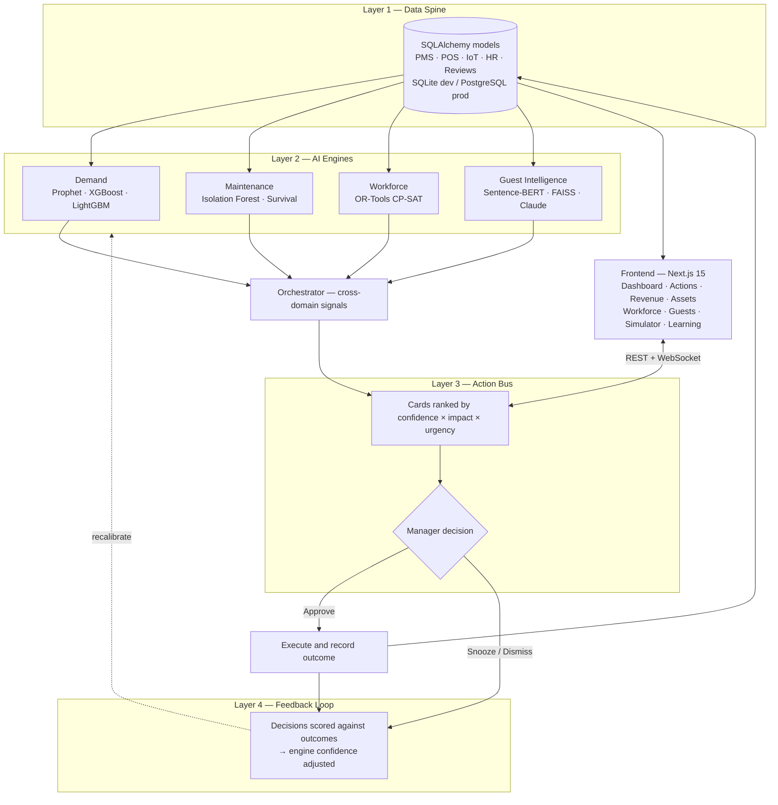

# Smart Resort 360

An AI-powered resort operations platform that unifies demand forecasting, predictive maintenance, workforce optimization, and guest intelligence into a single decision layer. Every insight surfaces as an approvable action card: the AI recommends, the manager decides, the system executes, and the outcome feeds back to calibrate future confidence.

Built for HackCelestial 3.0 — Problem Statement 4 by Team VOID.

**Stack:** Next.js 15 · React 19 · FastAPI · SQLAlchemy 2 · Python 3.11

---

## System Flow



---

## Features

| Module | Description |
|---|---|
| Live Dashboard | Real-time occupancy, revenue, sentiment, equipment health, and staffing gaps from a single data spine |
| Action Bus | AI-generated action cards ranked by impact, with one-click Approve / Snooze / Dismiss |
| Demand & Revenue | Prophet + XGBoost forecasting with rate recommendations inside floor/ceiling guardrails |
| Predictive Maintenance | Isolation Forest anomaly detection and survival analysis over IoT telemetry |
| Workforce Optimizer | OR-Tools CP-SAT solver assigning staff to shifts under labour and demand constraints |
| Guest Intelligence | Sentence-BERT embeddings and FAISS similarity search for guest profiling, plus an AI concierge |
| Revenue Simulator | What-if modelling of price, staffing, and promotion levers before committing |
| Feedback Loop | Acceptance rates and outcome accuracy adjust future engine confidence |
| 3D Resort Model | Three.js scene where lit windows map to rooms sold and markers to asset risk |
| Live Updates | New action cards pushed to the dashboard over WebSocket |

---

## Repository Layout

```
HackCelestial/
├── frontend/                 Next.js 15 app (App Router, Tailwind, Three.js, Recharts)
│   ├── app/                  One route per module — dashboard, actions, revenue,
│   │                         assets, workforce, guests, simulator, learning
│   ├── components/           Shared UI, charts, 3D scene, action card view
│   └── lib/                  API client, formatters, live-data hook
├── backend/                  FastAPI service
│   ├── app/
│   │   ├── main.py           App entrypoint and WebSocket hub
│   │   ├── models.py         SQLAlchemy models (data spine)
│   │   ├── api/routes.py     REST endpoints
│   │   ├── core/             Settings and database session factory
│   │   ├── engines/          demand · maintenance · workforce · guest
│   │   │                     orchestrator · action bus
│   │   └── seed/             Two-year synthetic data generator
│   ├── scripts/smoke.py      End-to-end smoke test
│   ├── requirements.txt      Light runtime set
│   └── requirements-ml.txt   Full ML stack
├── netlify.toml              Frontend deployment config
└── render.yaml               Backend blueprint
```

---

## Local Development

**Prerequisites:** Node.js 18+, Python 3.11+

### Backend

```bash
cd backend
python -m venv venv
source venv/bin/activate            # Windows: .\venv\Scripts\activate

pip install -r requirements-ml.txt  # or requirements.txt for the light set
python -m app.seed.generate         # seeds two years of resort data
uvicorn app.main:app --reload --port 8000
```

API at `http://localhost:8000`, health check at `/health`.

### Frontend

```bash
cd frontend
npm install
npm run dev
```

App at `http://localhost:3000`.

### Verify

1. Open the dashboard and confirm live data loads.
2. Run all engines to generate action cards.
3. Approve, dismiss, or snooze cards.
4. Open the Feedback Loop page and score outcomes.

The same path can be exercised headlessly — data spine → engines → action bus → approve → execute → outcome scoring:

```bash
cd backend
python -m scripts.smoke
```

---

## Deployment

### Backend — Render

The repo ships `render.yaml`, so a Blueprint deploy needs no manual configuration: connect the repo on Render, set `ANTHROPIC_API_KEY` if the LLM concierge is wanted, and deploy.

To configure by hand, create a Python web service with root directory `backend`, build command `pip install -r requirements.txt && python -m app.seed.generate`, start command `uvicorn app.main:app --host 0.0.0.0 --port $PORT --workers 1`, and health check path `/health`.

**Light vs. full dependency set.** `requirements.txt` contains only what the API needs to boot (FastAPI, SQLAlchemy, pandas, numpy, scikit-learn) and installs from wheels in about two minutes. The heavy stack lives in `requirements-ml.txt`; `sentence-transformers` alone pulls PyTorch (~2.5 GB), which will not fit the free tier's 512 MB. Every heavy import is lazy and guarded, so the API stays fully functional without them — the affected engines log a warning and degrade:

| Missing package | Engine | Fallback |
|---|---|---|
| `prophet` | Demand | Seasonal-naive baseline |
| `xgboost` | Demand | Prophet/naive leg only |
| `lightgbm` | Maintenance | Trend and anomaly rules |
| `ortools` | Workforce | Greedy scheduler |
| `faiss-cpu` | Guest | NumPy cosine search |
| `sentence-transformers` | Guest | Hashed bag-of-words |

Render's free tier uses ephemeral disk: the build seeds SQLite into the instance image, so demo data is present on boot and resets on each deploy. Free instances also sleep after roughly 15 minutes idle and take about 50 seconds to wake. For persistent data, attach managed PostgreSQL and set `DATABASE_URL`.

### Frontend — Netlify

`netlify.toml` supplies the base directory, publish directory, and Next.js plugin. Import the repo on Netlify and set `NEXT_PUBLIC_API_BASE` to the Render service URL **before** the first build — it is inlined at build time, so changing it requires a fresh deploy rather than a redeploy of the existing build. The same value derives the WebSocket URL (`https` → `wss`), and the backend CORS rule already allows `*.netlify.app`.

---

## Environment Variables

| Variable | Required | Default | Description |
|---|---|---|---|
| `DATABASE_URL` | No | SQLite file | PostgreSQL connection string; unset means zero-setup SQLite |
| `TIMESCALE_ENABLED` | No | `false` | Enable TimescaleDB hypertables |
| `REDIS_URL` | No | `redis://localhost:6379/0` | Celery broker and cache; unreachable means Celery runs eager |
| `ANTHROPIC_API_KEY` | No | unset | Claude-powered concierge and review summarisation; unset means extractive fallback |
| `LLM_MODEL` | No | `claude-opus-5` | Claude model identifier |
| `FORECAST_HORIZON_DAYS` | No | `30` | Demand forecast horizon in days |
| `NEXT_PUBLIC_API_BASE` | Frontend | `http://127.0.0.1:8000` | Backend API URL; set on Netlify |

---

## Problem Statement Mapping

| PS 4 requirement | Implementation |
|---|---|
| Unified data spine | SQLAlchemy models across PMS, POS, IoT, HR, and reviews (Layer 1) |
| AI/ML engines | Prophet, XGBoost, Isolation Forest, OR-Tools CP-SAT, Sentence-BERT (Layer 2) |
| Actionable recommendations | Action Bus with confidence-ranked cards (Layer 3) |
| Human-in-the-loop | Per-card Approve / Snooze / Dismiss workflow |
| Feedback and learning | Outcome scoring driving confidence adjustment (Layer 4) |
| Cross-domain intelligence | Guest sentiment informs staffing; demand drives maintenance windows |
| Real-time operations | WebSocket updates with stale-while-revalidate polling |
| Revenue optimization | Guardrailed rate cards plus a what-if simulator |

---

## License

Built for the HackCelestial 3.0 hackathon. All rights reserved by Team VOID.
